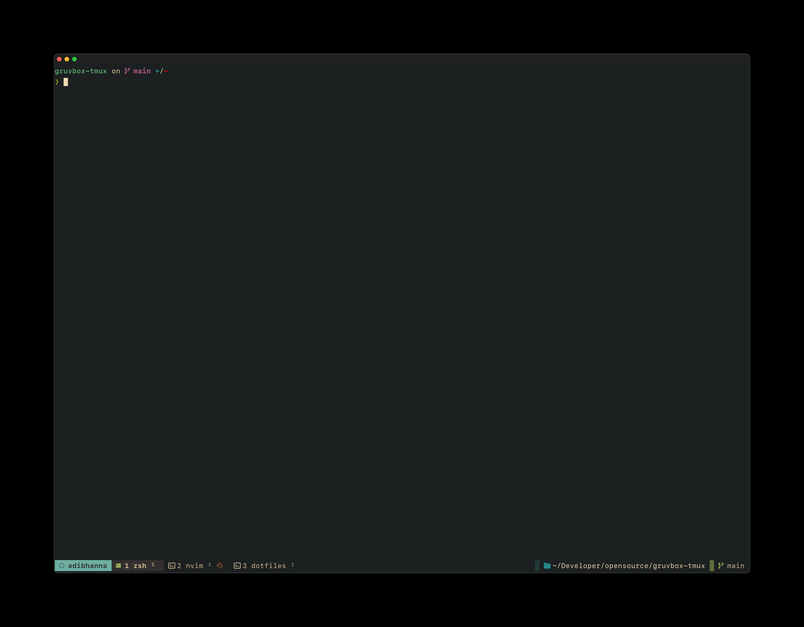
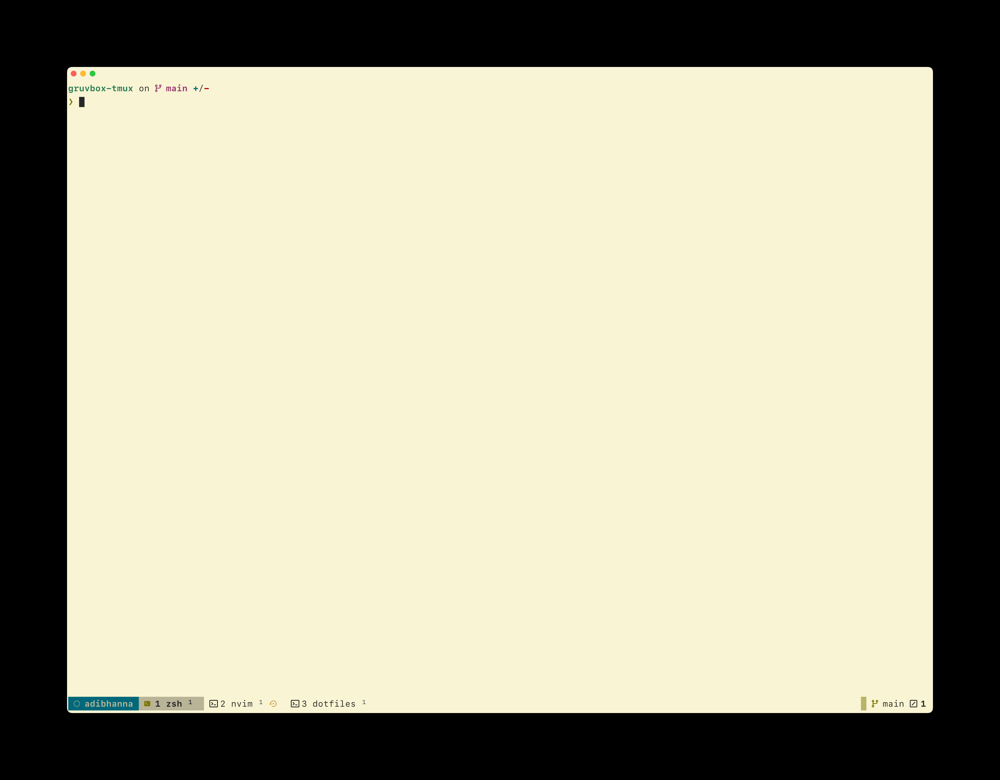

this is a simpified fork of https://github.com/janoamaral/tokyo-night-tmux all credit goes to the author ❤️.

I updated the colors to match the gruvbox colorscheme used in neovim and ghostty terminal.

```
set -g @plugin "adibhanna/gruvbox-tmux"
set -g @gruvbox-theme dark # dark or light

# Optional: Configure GitHub status display (default: on)
set -g @gruvbox-tmux_github_status on # on or off
```

## Features

- **Git Status**: Shows current branch, sync status, and change counts
- **GitHub Integration**: Displays open pull requests and issues count for the current repository
  - 󰘬 Pull requests (magenta)
  - 󰌶 Issues (red)
  - Requires GitHub CLI (`gh`) for authenticated requests or falls back to unauthenticated API calls
  - Results are cached for 5 minutes to improve performance
  - Can be disabled with `set -g @gruvbox-tmux_github_status off`
- **Custom Window Numbers**: Configurable window and pane number styles
- **Path Widget**: Shows current directory path

### GitHub Integration Setup

For the best experience with GitHub integration:

1. **Install GitHub CLI**: `brew install gh` (macOS) or follow [installation instructions](https://cli.github.com/)
2. **Authenticate**: `gh auth login`
3. **Enjoy unlimited API requests** without rate limiting

Without GitHub CLI, the extension falls back to unauthenticated API requests which are rate-limited to 60 requests per hour per IP address.

## Dark



## Light


